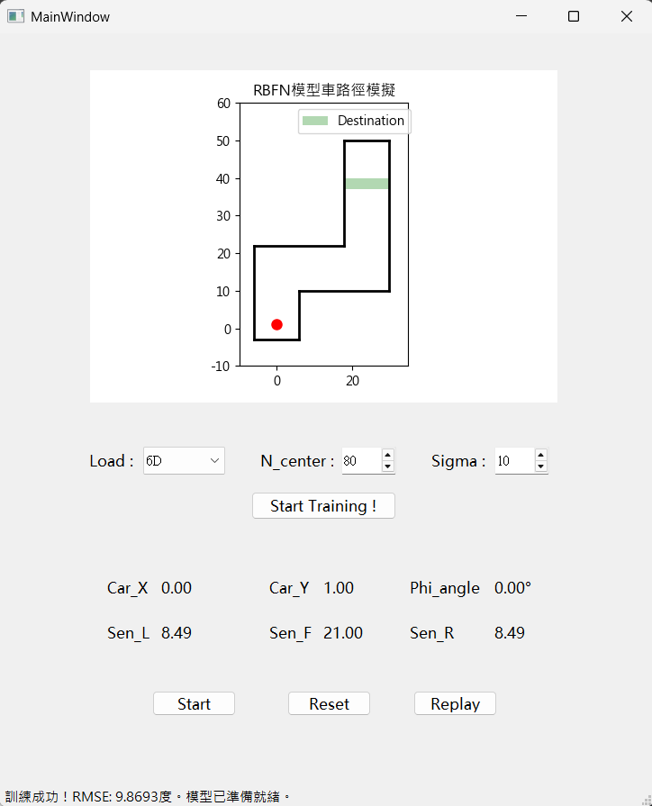
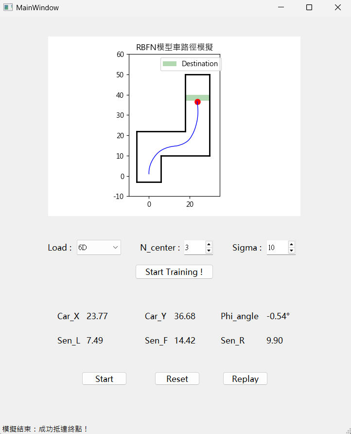
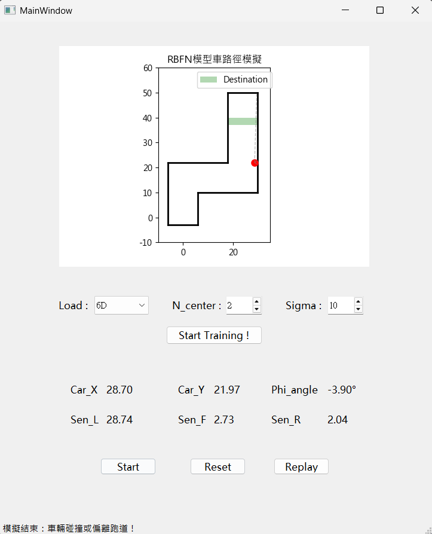
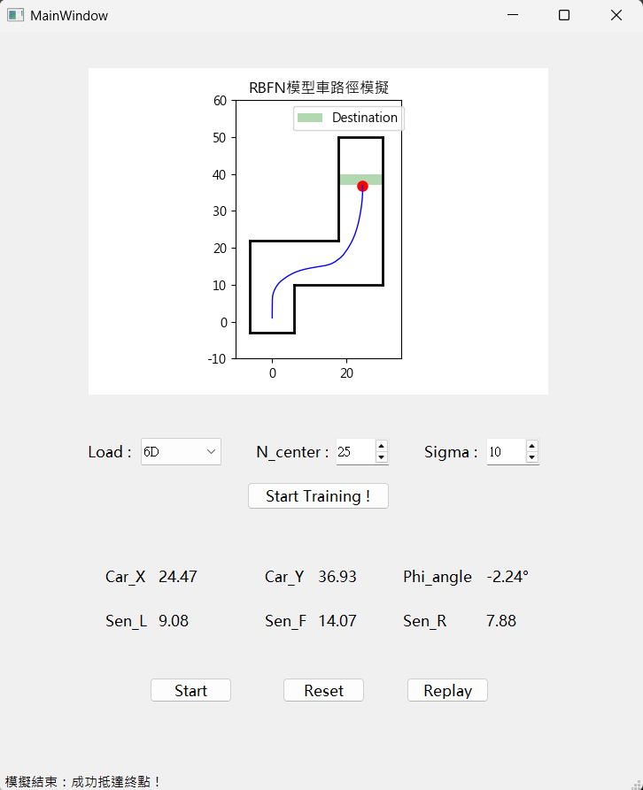

# RBFN 自駕車模擬控制系統 (Autonomous Navigation with RBFN)

> **類神經網路專案實作**：開發一個基於 **RBFN (徑向基函數網路)** 的自駕車控制器，實現具備即時訓練功能與動態物理模擬的避障導航系統。

本專案利用 RBFN 強大的非線性擬合能力，接收即時感測器數據並輸出方向盤轉角（φ angle），引導模型車在複雜跑道中精準導航並抵達終點。

---

## 技術亮點

*   **即時訓練與參數調優**：支援在 GUI 介面動態調整 `N_center` 與 `Sigma`，並利用 **Pseudo-Inverse** 進行秒級訓練，即時將訓練結果反映在模擬表現上。
*   **物理模擬引擎**：實作二維運動學模型與碰撞偵測機制，精確模擬車輛半徑（3 單位）與牆壁的交互關係。
*   **多維度感知模式**：支援 **4D 模式**（左前方、正前方、右前方 3 向感測器）與 **6D 模式**（3 向感測器 + 全局座標 $(x, y)$）的切換與效能比較。

---

## 實驗結果與分析

### 1. 最佳模型表現
根據實驗結果，系統在不同參數配置下的表現如下：
*   **最低誤差 (RMSE)**：當 $N\_center=80$ 時，訓練 RMSE 達到最小值 **9.8693**。
*   **最高幾何效率**：最佳平衡點為 $(N\_center=3, \sigma=10)$，此模型能以最短路徑（**50 步**）且最平滑的軌跡完成任務。

| 最低誤差 (RMSE) | 最高幾何效率 |
| :---: | :---: |
|  |  |
| *圖 1：center = 80 / sigma = 10下模擬結果* | *圖 2：center = 3 / sigma = 10下模擬結果* |

### 2. 參數敏感度分析 (Critical Insight)
*   **N_center 的影響**：
    *   **Underfitting**：當 $N\_center$ 過低（如 2）時，模型無法捕捉轉向趨勢，車輛離開起點沒多久便立即失控撞牆。
    *   **Overfitting**：隨 $N\_center$ 增加（如 20 以上），雖然 RMSE 持續下降，但動態模擬中會出現不必要的微調使得迴轉半徑變大。
*   **碰撞偵測驗證**：實驗觀測到碰撞發生時感測器讀數精確停在 **2.0~3.0 單位**，驗證了物理引擎計算車體邊緣與軌道接觸的嚴謹性。

| Underfitting | Overfitting |
| :---: | :---: |
|  |  |
| *圖 3：center = 2 / sigma = 10下模擬結果* | *圖 4：center = 25 / sigma = 10下模擬結果* |

---

## 開發環境與工具

*   **語言**：Python 3.11
*   **核心庫**：NumPy, Pandas, Scikit-learn
*   **介面**：PyQt / UI Designer
*   **模型架構**：RBFN 控制器（K-Means Clustering中心 + pseudo-inverse matrix 權重求解）

---

## 資料夾結構說明

*   `gui_test_run.py`: 模擬器主程式與 PyQt 邏輯控制
*   `train_utils.py`: RBFN 模型類別定義與資料載入器
*   `simple_playground.py`: 物理模擬環境、運動學與碰撞偵測核心
*   `rbfn_model_weights.npz`: 預訓練之最佳模型權重資產
*   `Report.pdf`: 包含詳盡的參數測試紀錄、RMSE 對比圖及路徑效率分析

## 完整技術報告
關於不同模式下的參數敏感度分析與更詳盡的測試數據，請參閱 [完整書面報告](./Report.pdf)。

---

**開發心得**：
此專案展現了如何將**統計學原理**（K-Means Clustering）應用於神經網路的結構設計中，透過實作即時訓練功能，我掌握了如何在動態系統中即時調整超參數以優化控制邏輯，這在自動駕駛與精密控制領域是極為核心的實務經驗。
